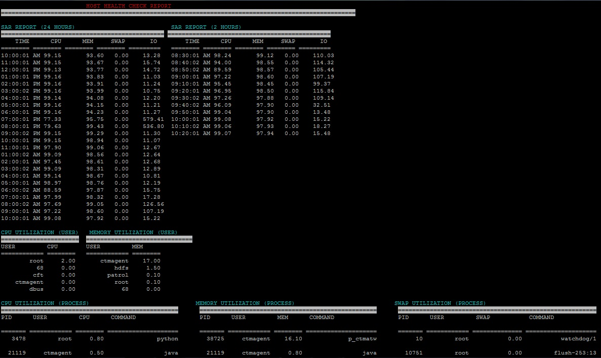

## HostChecker

This utility will help in creating a consolidated report of a health of a Linux host. 

All administrator, whether they are platform administrator or service administration at one point of time they would require to check health of host. This tool is meant to do just that. Using this tool with little or no effort you can quickly have a good understanding about the health of you Linux host.

Few of the important points regarding the tool:
  A. Gives a latest host status along with historical view.
  B. Gives usage report as per CPU, Memmory and Health.
  C. Gives system resourse, CPU and Memory usage data per user.
  B. It helps you to analyse the system resource statistics for last 24 hours(hourly) and last 2 hours(every 15 mins).

Below is a sample report.

Note
  1. Installation is extremely simple and consists of coping the directory and giving appropiate permission to the main executable. 
  2. Note this tool is only usable in Linux environment with Bash and SAR utility available.
  
Support and managebility

If you are reading this README file then you are probably about to use the my tools to help you monitor your Linux Host. Good choice. This tool is made for you. Moreover this tool is free and always will be thats my promise.

Now it is hard to believe that you will get 24/7 Support thats too much to ask for. But in case you face any issue and want my intervention and you cannot debug the hundreeds lines of core Bash Script your self, please do not hassitate to write to me. Its a guarentee you will get an answer but it is not a guarentee you will have it in a SLA.

Reach Me: sanmuk21@gmail.com

Best of luck. Happy Monitoring your Linux host.
